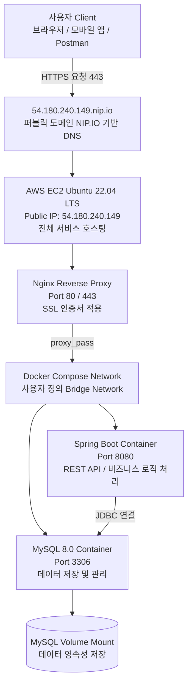
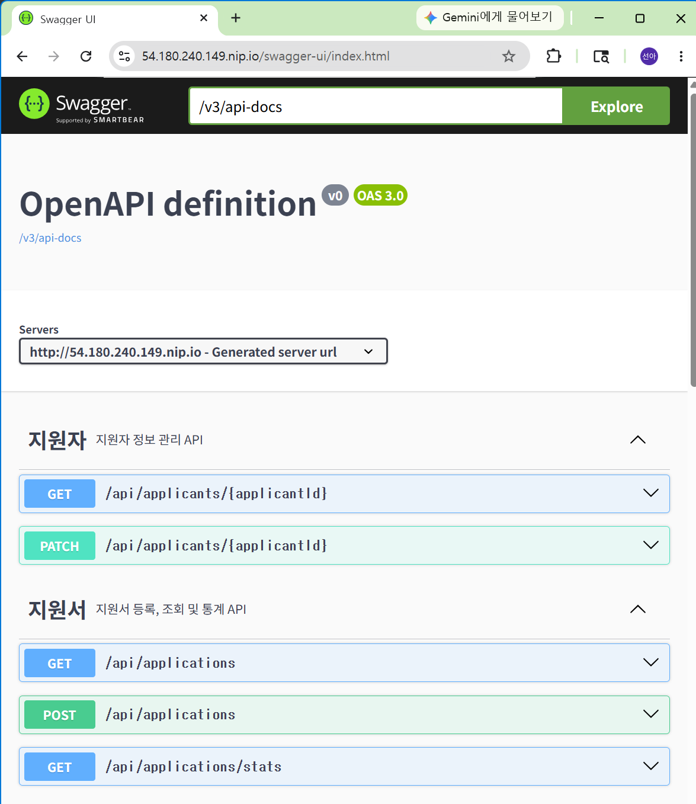
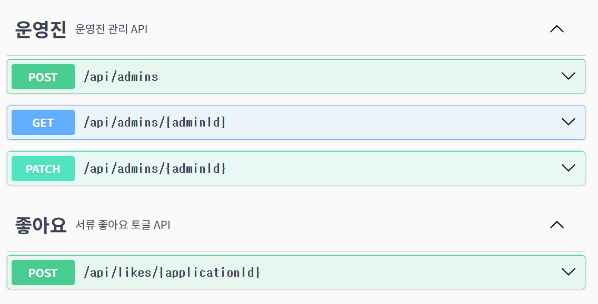

# 13기 BE 네트워킹 배포 과제 설명서

## 1. 아키텍처 다이어그램



--- 

## 2. 배포 URL

- **기본 배포 주소** : https://54.180.240.149.nip.io
- **Swagger API 명세서 주소** : https://54.180.240.149.nip.io/swagger-ui/index.html

--- 

## 3. 배포된 Swagger 접속 화면 캡처





--- 

## 4. GitHub Actions 성공 화면 캡처


--- 

## 5. 배포 파이프라인 및 브랜치 전략

1. **개인 작업 및 1차 검증 (`pearseona` ➡️ `develop`)**
   - 포크(Fork)해 온 개인 레포지토리의 `pearseona` 브랜치에서 기능을 구현.
   - 구현 완료 후, 개인 레포지토리의 `develop` 브랜치로 Pull Request(PR)를 보냄.
2. **CI/CD 자동화 파이프라인 통과**
   - `develop` 브랜치에 코드가 머지되면 **GitHub Actions를 통해 CI/CD 프로세스가 동작**.
   - 빌드(Build) 및 테스트 코드가 정상적으로 통과하는지 검사하여 코드의 안정성을 자동 검증.
3. **메인 레포지토리 반영 (`develop` ➡️ `Cotato Develop Repository`)**
   - 개인 레포지토리에서 빌드 및 테스트가 완벽히 성공한 것을 확인한 후, **Cotato 레포지토리로 최종 PR을 요청**하고 코드 리뷰를 진행.

--- 

## 6. Dockerfile / Nginx 설정 내용

### 1. Dockerfile (Spring Boot)

```
    FROM eclipse-temurin:17-jdk-alpine
    
    ARG JAR_FILE=build/libs/*.jar
    
    COPY ${JAR_FILE} app.jar
    
    ENTRYPOINT ["java", "-jar", "-Dspring.profiles.active=prod", "/app.jar"]
```

### 2. Nginx 설정 파일 (`default.conf`)

```
    server {
    listen 80;
    server_name 54.180.240.149.nip.io;
    return 301 https://$host$request_uri;
}

server {
    listen 443 ssl;
    server_name 54.180.240.149.nip.io;

    ssl_certificate /etc/letsencrypt/live/54.180.240.149.nip.io/fullchain.pem;
    ssl_certificate_key /etc/letsencrypt/live/54.180.240.149.nip.io/privkey.pem;

    location / {
        proxy_pass http://cotato-app:8080;
        proxy_set_header Host $host;
        proxy_set_header X-Real-IP $remote_addr;
        proxy_set_header X-Forwarded-For $proxy_add_x_forwarded_for;
        proxy_set_header X-Forwarded-Proto $scheme;
    }
}
```

--- 

## 7. 트러블 슈팅 노트

### 📌 이슈 1: 도커 컴포즈 버전 호환성 에러

- 문제: EC2 인스턴스에서 docker-compose up -d 실행 시 Version in "./docker-compose.yml" is unsupported 에러 발생.

- 원인: 우분투 22.04 패키지 매니저로 기본 설치된 Docker Compose 구버전(1.x)이 최신 문법 사양인 version: '3.8'을 인식하지 못함.

- 해결: docker-compose.yml 파일의 사양 첫 줄을 구버전 엔진도 해석 가능한 version: '3.3'으로 수정하여 정상 구동 완료.

### 📌 이슈 2: Docker Daemon 접속 권한 에러

- 문제: docker-compose up -d 구동 시 Couldn't connect to Docker daemon 메시지 출력 및 연결 실패.

- 원인: 새 EC2 인스턴스 환경 생성 후 도커 기본 프로세스가 비활성화되어 있었거나, 현재 접속 계정인 ubuntu 유저에 도커 실행 그룹 권한이 즉시 새로고침되지 않아 발생함.

- 해결: sudo systemctl start docker 명령으로 데몬을 강제 구동하고, sudo usermod -aG docker ubuntu 및 newgrp docker를 통해 로그아웃 없이 계정 권한을 즉시 갱신하여 해결.

